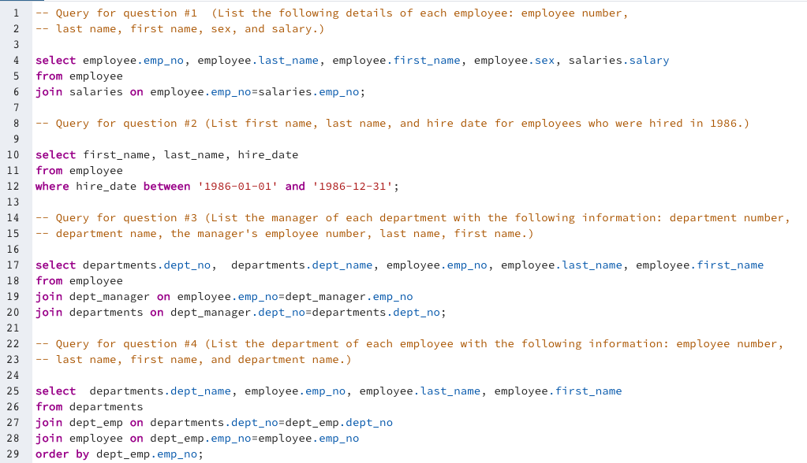
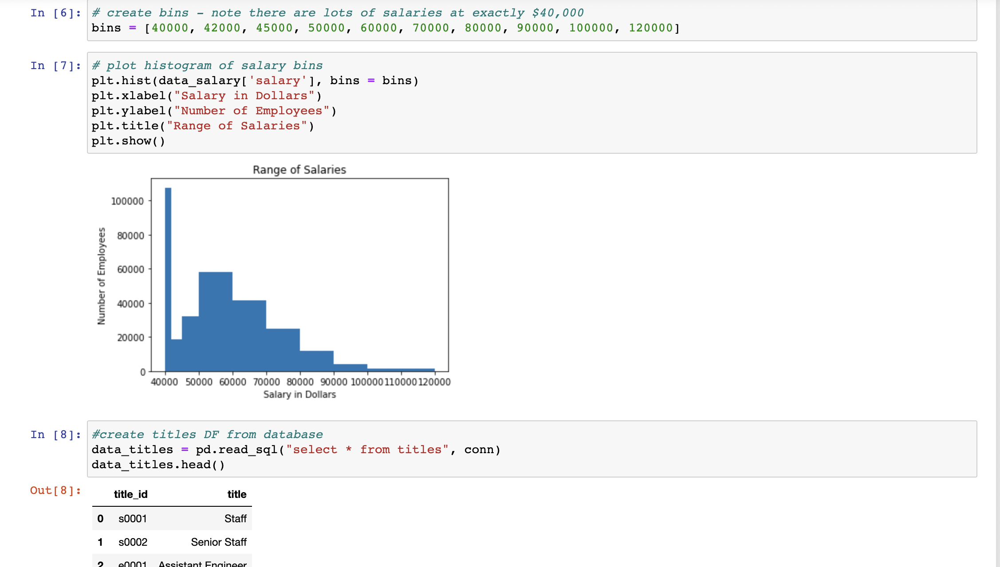

Summary/Problem: This repo contains SQL and Jupyter notebook documentation to assist with the analysis and organization of a company's employee database. SQL queries are used to help combine/merge datests to help make sense of multiple datasets with unique columns/characteristics. The additional jupyter notebook analysis provides plots to help determine the range of salaries with the employees and salaries by employee title/position.

***
### Repo Contents
The files within the repo include the following:

+ hw_9_table_schemata.sql
    + This is the sql file for the code that is generated from the QuickDBD website. Please note that there have been some comments added to the code
+ hw_9_queries.sql
    + This sql file includes the eight queries requested in the homework assignment
        
+ quickDBD_ERD_snapshot.png
    + This is the image of the ERD created from the quickDBD website
+ sql-challenge-hw-9.ipynb
    + This is the jupyter notebook for deeper analysis into the employee database utilizing psycopg2.
    

***

NOTE - the _do_not_use folder contains one SQL file which is the two above SQL files combined.
